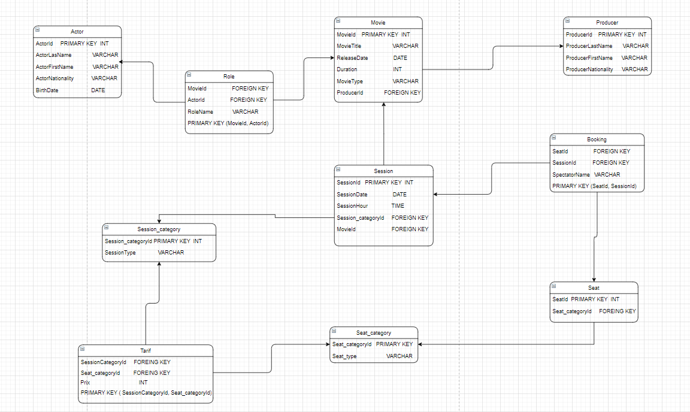
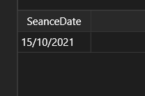
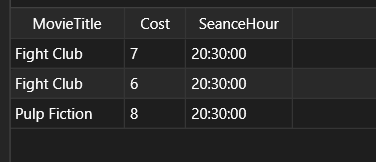
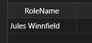
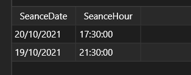
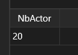
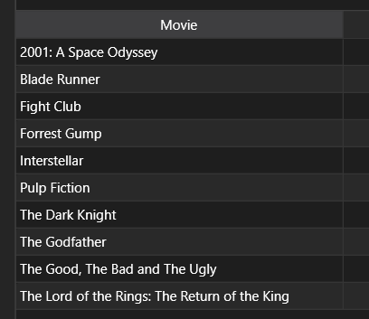
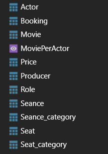
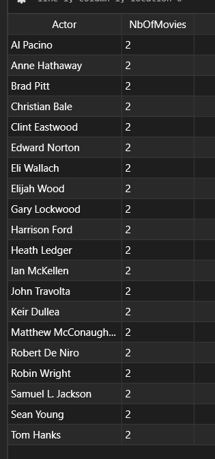

# SQLProject
***

## Présentation du sujet

Ce projet consistait à modéliser, créer, peupler puis utiliser une Base De Données (BDD) en SQL. Pour ce faire, nous étions 2 : **Louis TEILLIAIS** & **Tao BOURMAUD**. Le projet s'est étendu sur une période de 2 semaines.

Tout d'abord, nous devions créer un modèle relationnel de la BDD, puis, en reprenant notre modèle, créer notre BDD avec les bonnes tables et bonnes colonnes dans chaque tables. Ensuite on a du peupler notre BDD, manuellement car nous n'avons pas fait l'injection automatique, pour pouvoir enfin rélaiser des requêtes sur notre BDD.

Les livrables étaient donc : 

- Le modèle relationnel de la BDD
- Le fichier SQL de création de la BDD
- Le fichier SQL des requêtes clientes
- Des tests des requêtes clientes
- Un support de présentation

***

## Structure du code 

Notre code est organisé en 3 fichiers distinct. Le premier, *table.sql* contient tout le code permettant la création des tables de la BDD. Le second *insert.sql* contient tout le code à effectuer pour peupler notre BDD avec les infos que nous avons décidé d'insérer. Enfin, le troisième *requetes.sql* contient tout le code à effectuer pour faire les 10 requêtes demandé. Nous avons également le modèle relationnel de la BDD présent dans le fichier *Modèle de données.drawio*, pouvant être ouvert sur Draw.io ou bien sur VSCode grâce à l'extension **Draw.io Integration**. Vous pouvez sinon voir notre modèle ci-dessous : 

***

## Utilisation du code

Afin d'utiliser notre code, il vous faudra seulement, après avoir créer une base de données, faire un **Run All** de chaque fichier sur TablePlus dans le bon ordre. Vous venez de recréer notre BDD, bravo !
***
## Peuplement de la BDD

En ce qui concerne la partie peuplement de la BDD, nous nous sommes concertés à deux pour réfléchir tout d'abord à la logique que nous allions suivre pour remplir la BDD. Nous sommes partis sur un système simple, ajouter les 10 films présents dans le top 10 du site [SensCritique, vos 100 films préférés](https://www.senscritique.com/films/tops/top100-des-top10). Ensuite, pour chaque film, on a ajouté deux acteurs jouant des roles importants (20 acteurs en tout), les producteurs de chaque film (9 car Cristopher Nolan est le producteur de 2 films), les rôles de chaque acteur et deux séances par film. Ensuite pour les séances, nous avons créé cinq catégories, dix sièges par séances avec six catégories de places et enfin des prix variés en fonction du type de la séance et de la place.

En somme, nous n'avons pas créer notre BDD de manière à pouvoir faire des tests des requêtes simples, car pour la plus part des requêtes nous affichons peu de résultat.
***

## Création des requêtes

C'est pourquoi nous avons souvent *UPDATE* ou *INSERT INTO* des eléments de notre BDD, pour pouvoir tester au mieux la cohérence de nos requêtes. 

***
## Résultats des requêtes

Voici maintenant les résultat obtenus pour chaque requêtes :

- Requête 1 : *Donner les dates des séances (sans répétition) des films dans lesquels l’acteur numéro 1 joue*   

- Requête 2 : *Donner les films offrant des séances en semaines après 18h00 avec un tarif inférieur à 10 EUR*   
   

- Requête 3 : *Donner les noms des rôles de l’acteur numéro 4 triées par ordre alphabétique*    
   

- Requête 4 : *Donner les dates et les horaires des séances du film numéro 7 triées par ordre décroissant selon les dates et croissant selon les horaires*   
   

- Requête 5 : *Donner le nombre d’acteurs de la BDD*   

- Requête 6 : *Donner le titre des films projetés pendant exactement deux séances*   

- Requête 7 : *Donner les noms et prénoms des réalisateurs qui ont travaillé avec l’acteur dont le nom est donné*   

- Requête 8 : *Donner le classement des acteurs selon le nombre de rôle réalisés par ordre décroissant*   

- Requête 9 : *Réaliser une vue(View) contenant pour chaque acteur le nombre de séance où l’on a pu voir des films dans lequel il a participé. Afficher le contenu de la vue.*
    - Etape 1 : *Réaliser une vue(View) contenant pour chaque acteur le nombre de séance où l’on a pu voir des films dans lequel il a participé.*   
    

    - Etape 2 : *Afficher le contenu de la vue.*   
    

- Requête 10 : *Ecrire un déclencheur (Trigger) qui lorsque l’on réalise une réservation sur la place n°1, le fait puis change la catégorie de la place en  catégorie spéciale. Vérifier le fonctionnement du déclencheur.*   
    - Rien d'observable ...

